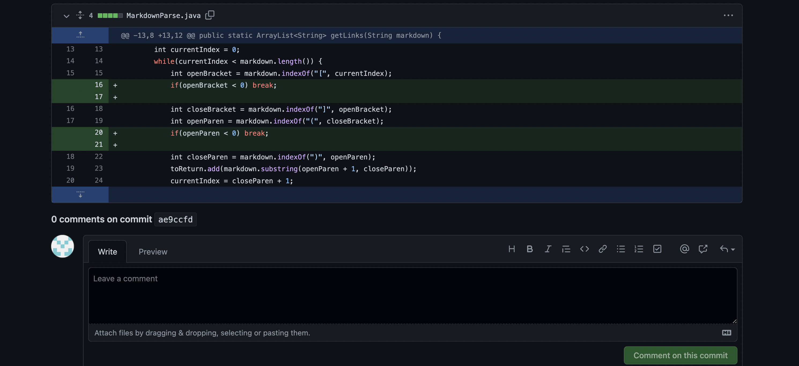
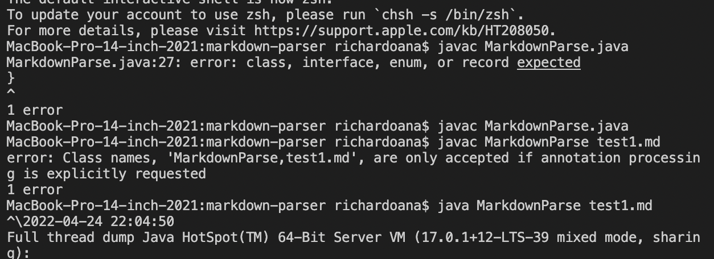
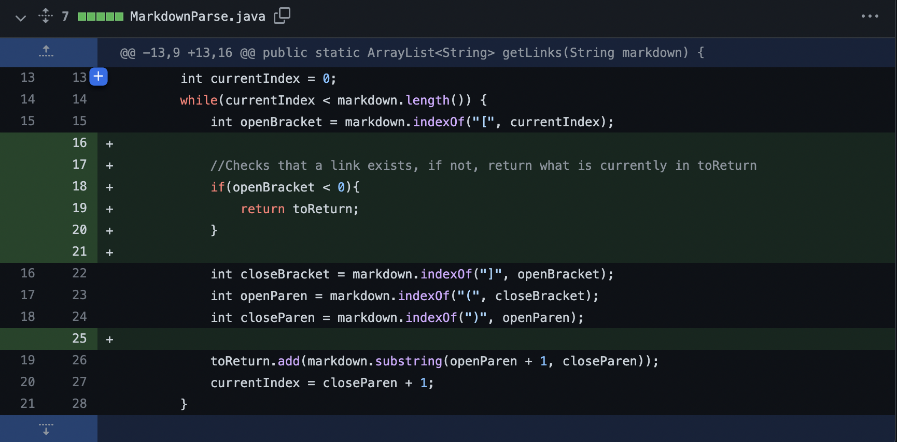
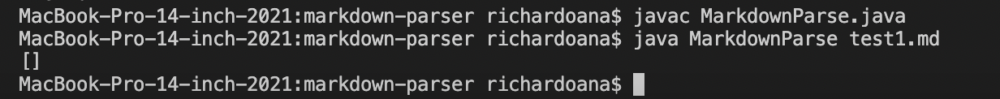
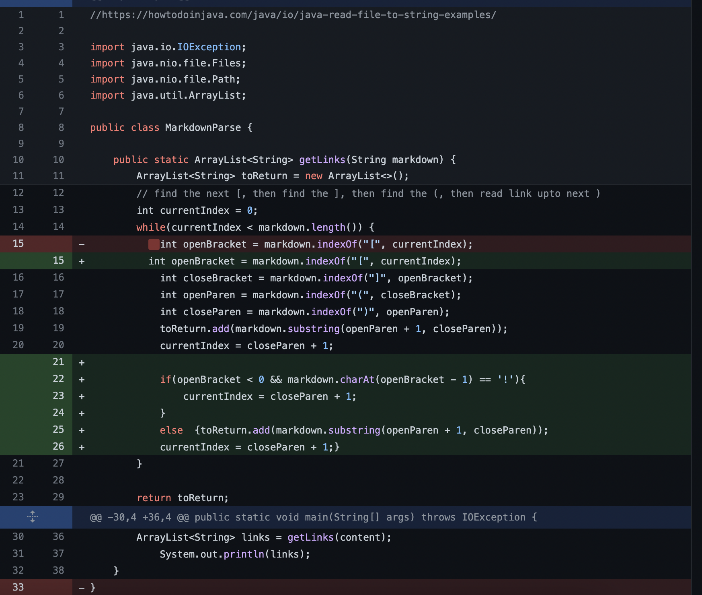
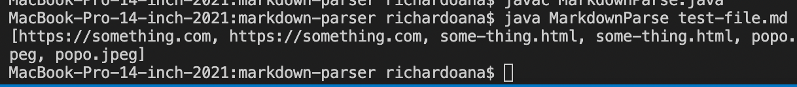

# Lab Report 2

## Example 1 - Infinite Loop Fixing for getLinks

[Josh's Test](https://github.com/Joshjppark/markdown-parser/commit/a730bb5a104234452fc0389fdb2dcd339273f477)

Josh had encountered a problem where the loop within the starter code would not stop looping infinitely. By adding if statements to break the loop, it had fixed the problem if test files containted links that will set off the loop.

## Example 2 - No Link fix

[Edward's test](https://github.com/EdwardNew/markdown-parser/commit/6e02cd6bcf40bb1938e85b9a0791326e94951081)

Previously, if you had no content, (in this case link), within a test file, the code would not work successfully. With Edward's fix, the output would just return an empty output and the code would run properly.

## Example 3 - Image link fix

[My Test}(https://github.com/richarddau/markdown-parser/commit/af2c7131d21dfc610675eaef8b9c38f26e49af08)

The code would not respond if a test file would contain a image markdown link. I added a fix so it would print out the file name of the image. 

